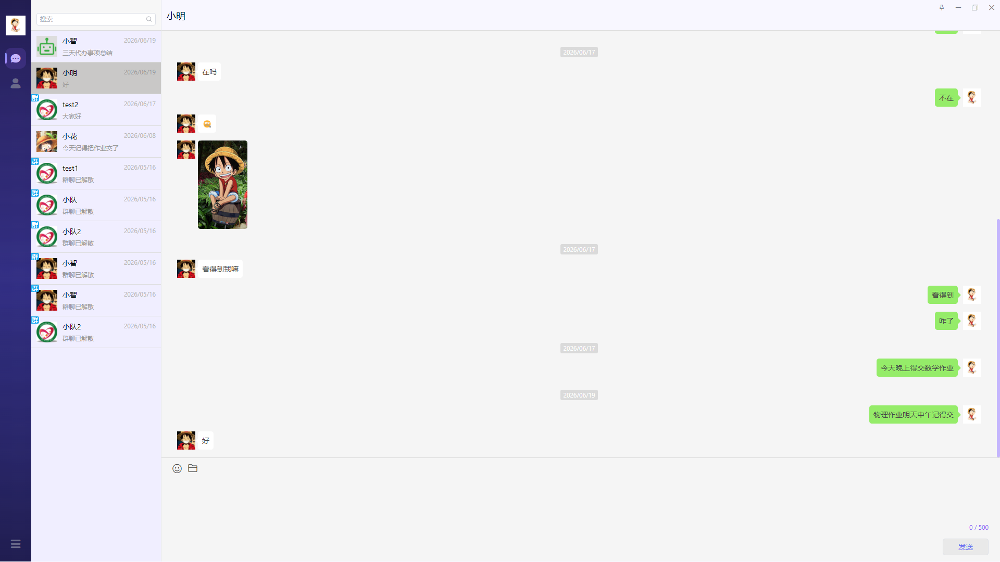
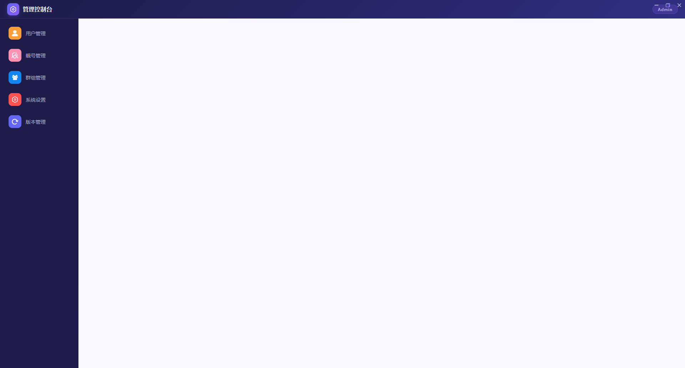

# Chat SpringCloud

基于 **Spring Cloud 微服务** + **Electron Vue.js** 的即时通讯桌面应用，支持单聊、群聊、AI 智能对话。

## 技术栈

| 层级 | 技术 |
|------|------|
| 后端框架 | Spring Boot + Spring Cloud |
| 服务治理 | Spring Cloud Gateway |
| 数据库 | MySQL + MyBatis-Plus |
| 缓存 | Redis |
| 实时通信 | Netty WebSocket |
| 桌面客户端 | Electron + Vue 3 + Vite |
| UI 组件 | Element Plus |

## 项目结构

```
chat-springcloud/
├── backend/                          # Spring Cloud 微服务后端
│   ├── gateway/                     # API 网关 — 统一入口、路由转发
│   ├── model/                       # 公共模块 — 实体类、工具类、AOP
│   ├── services/                    # 业务微服务
│   │   ├── chat-agent/             # AI 对话代理服务
│   │   ├── chat-message-manager/   # 消息管理服务
│   │   └── user-info-manager/      # 用户信息管理服务
│   └── pom.xml                      # 父 POM
├── frontend/                         # Electron + Vue 3 桌面客户端
│   ├── src/main/                    # Electron 主进程（窗口管理、IPC、WebSocket）
│   ├── src/preload/                 # 预加载脚本
│   ├── src/renderer/                # Vue 3 渲染进程（页面、组件、路由）
│   └── package.json
└── assest/                           # 项目截图
```

## 功能概览

### 登录界面
支持账号密码登录、记住密码、自动登录等功能。


### 主界面
即时通讯核心界面，支持单聊、群聊、消息收发、文件传输、表情发送。



### 后台管理
后台管理面板，支持用户管理、群组管理、系统设置、应用更新管理。



## 快速开始

### 环境要求

- JDK 17+
- Maven 3.8+
- MySQL 8.0+
- Redis 6.0+
- Node.js 18+

### 后端启动

```bash
# 1. 克隆项目
git clone https://github.com/NJX-cyber/chat-springcloud.git
cd chat-springcloud

# 2. 配置数据库和 Redis（修改各模块 application.yml）

# 3. 编译打包
cd backend
mvn clean package -DskipTests

# 4. 按顺序启动服务
# Gateway > 各微服务模块
```

### 前端启动

```bash
cd frontend

# 安装依赖
npm install

# 开发模式
npm run dev

# 打包桌面应用
npm run build:win
```

## License

MIT
