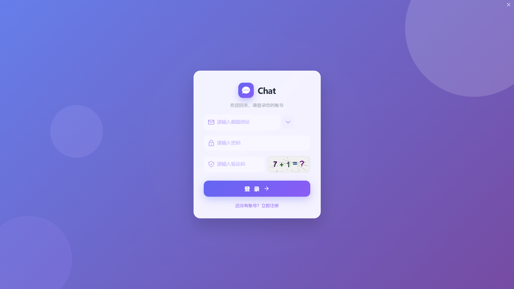
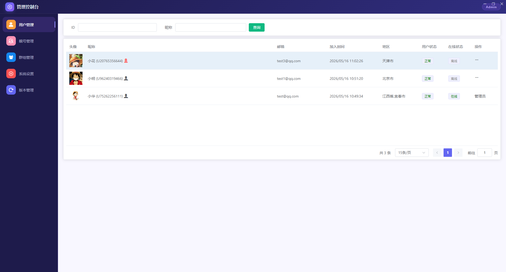

# Chat-SpringCloud — 智能聊天平台（全栈项目）

基于 **Spring Cloud 微服务** + **Electron Vue 3** 的即时通讯桌面应用，支持单聊群聊、实时消息推送、AI 智能助手（RAG + 大模型）、文件收发、后台管理等核心功能。

---

## 目录

- [项目截图](#项目截图)
- [项目架构](#项目架构)
- [技术栈](#技术栈)
- [项目结构](#项目结构)
- [模块说明](#模块说明)
  - [后端 — Gateway（网关）](#1-gateway网关)
  - [后端 — user-info-manager（用户管理）](#2-user-info-manager用户管理)
  - [后端 — chat-message-manager（消息管理）](#3-chat-message-manager消息管理)
  - [后端 — chat-agent（AI 智能体）](#4-chat-agentai-智能体)
  - [前端 — Electron + Vue 3 桌面客户端](#5-前端--electron--vue-3-桌面客户端)
- [快速启动](#快速启动)
- [API 接口文档](#api-接口文档)
- [消息推送机制](#消息推送机制)
- [AI 智能助手](#ai-智能助手)
- [配置说明](#配置说明)
- [Docker 部署](#docker-部署)
- [常见问题](#常见问题)
- [开发约定](#开发约定)

---

## 项目截图

### 登录界面


### 主界面


### 后台管理


---

## 项目架构

```
                          ┌──────────────────────┐
                          │  Electron + Vue 3     │
                          │  桌面客户端            │
                          └──────────┬───────────┘
                                     │ HTTP / WebSocket
                          ┌──────────▼───────────┐
                          │   Gateway :8800       │  ← Spring Cloud Gateway
                          │  统一入口 + 路由 + LB  │
                          └──────────┬───────────┘
                                     │
              ┌──────────────────────┼──────────────────────┐
              │                      │                      │
     ┌────────▼────────┐  ┌─────────▼────────┐  ┌─────────▼────────┐
     │user-info-manager│  │chat-message-     │  │   chat-agent     │
     │     :8088       │  │   manager :8089  │  │     :8090        │
     │  用户/群组/联系人 │  │ 消息/文件/WS推送  │  │  AI对话/RAG     │
     └────────┬────────┘  └─────────┬────────┘  └─────────┬────────┘
              │                      │                      │
              └──────────────────────┼──────────────────────┘
                                     │
              ┌──────────────────────┼──────────────────────┐
              │                      │                      │
     ┌────────▼────────┐  ┌─────────▼────────┐  ┌─────────▼────────┐
     │     MySQL        │  │     Redis        │  │    MongoDB       │
     │   业务数据       │  │  缓存/Pub/Sub    │  │  AI对话历史      │
     └─────────────────┘  └──────────────────┘  └──────────────────┘

                    ┌──────────────────────────┐
                    │      Nacos :8848          │
                    │   服务注册发现 + 配置中心   │
                    └──────────────────────────┘
```

**通信方式**：HTTP 请求经 Gateway 统一路由，服务间 RPC 通过 OpenFeign，异步消息通过 Redisson Pub/Sub，客户端实时推送通过 Netty WebSocket。

---

## 技术栈

### 后端

| 层级 | 技术 | 版本 |
|------|------|------|
| **基础框架** | Spring Boot | 3.3.4 |
| **微服务** | Spring Cloud (Gateway / OpenFeign / LoadBalancer) | 2023.0.3 |
| **服务治理** | Spring Cloud Alibaba (Nacos) | 2023.0.3.2 |
| **ORM** | MyBatis-Plus | 3.5.11 |
| **数据库** | MySQL 8.0 / MongoDB 7 / Redis 7 | — |
| **实时通信** | Netty (WebSocket) | 4.1.111 |
| **分布式消息** | Redisson (Pub/Sub) | 3.23.5 |
| **AI 框架** | LangChain4j | 1.0.0-beta3 |
| **AI 模型** | 阿里通义千问 (Qwen-Max / Qwen-Plus) | — |
| **韧性防护** | Resilience4j (熔断/限流/超时) | 2.2.0 |
| **API 文档** | Knife4j (OpenAPI 3.0) | 4.3.0 |
| **构建工具** | Maven | 3.9+ |
| **JDK** | Java 17 | — |

### 前端

| 层级 | 技术 | 版本 |
|------|------|------|
| **桌面框架** | Electron | 25.6.0 |
| **前端框架** | Vue 3 | 3.3.4 |
| **构建工具** | Vite / electron-vite | 4.4.9 |
| **UI 组件库** | Element Plus | 2.4.3 |
| **状态管理** | Pinia | 2.1.7 |
| **路由** | Vue Router | 4.2.5 |
| **HTTP 客户端** | Axios | 1.6.2 |
| **WebSocket** | ws | 8.16.0 |
| **Markdown 渲染** | marked | 18.0.5 |
| **视频播放** | DPlayer | 1.27.1 |
| **本地存储** | electron-store / sqlite3 | 8.1.0 / 5.1.6 |
| **打包工具** | electron-builder | 24.6.3 |
| **CSS 预处理** | Sass | 1.69.5 |

---

## 项目结构

```
chat-springcloud/
├── backend/                               # Spring Cloud 微服务后端
│   ├── pom.xml                            # 根 POM，统一依赖管理
│   ├── gateway/                           # API 网关模块
│   │   ├── pom.xml
│   │   └── src/main/resources/
│   │       ├── application.yml            # 网关配置 (端口 8800)
│   │       └── application-route.yml      # 路由规则
│   ├── model/                             # 公共模块（实体/枚举/工具类/AOP/Feign）
│   │   └── src/main/java/com/example/model/
│   │       ├── Redis/                     # Redis 工具类
│   │       ├── feign/                     # Feign 客户端 + 降级处理
│   │       ├── aspect/                    # AOP 切面（登录鉴权 + 限流）
│   │       ├── annotation/                # 自定义注解（@GlobalInterceptor / @RateLimit）
│   │       ├── exception/                 # 全局异常处理
│   │       ├── config/                    # 公共配置
│   │       ├── entity/                    # 实体/DTO/VO/查询对象
│   │       ├── enums/                     # 枚举类
│   │       └── utils/                     # 工具类
│   └── services/                          # 业务微服务
│       ├── pom.xml                        # 服务父 POM
│       ├── user-info-manager/             # 用户管理服务 :8088
│       ├── chat-message-manager/          # 消息管理服务 :8089 + WS :5051
│       └── chat-agent/                    # AI 智能体服务 :8090
├── frontend/                               # Electron + Vue 3 桌面客户端
│   ├── package.json                        # 依赖与脚本
│   ├── electron-builder.yml               # Electron 打包配置
│   ├── electron.vite.config.js            # Vite 构建配置
│   ├── assest/                            # 项目截图
│   │   ├── login.png
│   │   ├── main.png
│   │   └── back-stage-management.png
│   ├── assets/                            # 静态资源（字体/图片/视频）
│   ├── resources/                         # 应用图标
│   ├── build/                             # 构建资源（平台图标/签名配置）
│   └── src/
│       ├── main/                          # Electron 主进程
│       │   ├── index.js                   # 应用入口（窗口创建/生命周期）
│       │   ├── wsClient.js                # WebSocket 客户端
│       │   ├── request.js                 # HTTP 请求封装
│       │   ├── windowProxy.js             # 窗口代理（登录/主窗口切换）
│       │   ├── listen-ipc.js              # IPC 通信监听
│       │   ├── file.js                    # 文件操作
│       │   ├── store.js                   # 本地存储
│       │   └── db/                        # SQLite 数据库（本地消息/会话缓存）
│       ├── preload/                       # 预加载脚本（桥接主进程与渲染进程）
│       │   └── index.js
│       └── renderer/                      # Vue 3 渲染进程
│           ├── index.html                 # HTML 入口
│           └── src/
│               ├── App.vue                # 根组件
│               ├── main.js                # Vue 应用入口
│               ├── router/                # 路由配置
│               ├── stores/                # Pinia 状态管理
│               ├── components/            # 通用组件
│               ├── utils/                 # 工具函数（请求/API/表情/验证）
│               └── views/                 # 页面视图
│                   ├── Login.vue          # 登录页
│                   ├── Main.vue           # 主布局
│                   ├── chat/              # 聊天模块（消息/会话/文件/视频）
│                   ├── contact/           # 通讯录模块（好友/群组/搜索）
│                   ├── setting/           # 设置模块（个人信息/关于/更新）
│                   └── admin/             # 后台管理模块
└── README.md
```

---

## 模块说明

### 1. Gateway（网关）

| 职责 | 说明 |
|------|------|
| 统一路由 | 所有 `/api/**` 请求通过 Gateway 转发到对应微服务 |
| 负载均衡 | 通过 `lb://service-name` 实现客户端负载均衡 |
| 路径重写 | `RewritePath` 将 `/api/{segment}` 转为 `/{segment}` |
| 跨域处理 | 全局 CORS 配置 |
| 大文件支持 | `max-in-memory-size: 200MB` |

**路由规则**：

| 路径前缀 | 目标服务 |
|---------|---------|
| `/api/account/**`, `/api/groupInfo/**`, `/api/userContact/**`, `/api/userInfo/**`, `/api/admin/**`, `/api/systemVersion/**` | `user-info-manager` |
| `/api/chat/**` | `chat-message-manager` |
| `/api/agent/**` | `chat-agent` |

### 2. user-info-manager（用户管理）

> 端口：**8088**

| 功能模块 | 关键 Controller |
|---------|----------------|
| 注册/登录/验证码 | `AccountController` |
| 用户信息管理 | `UserInfoController` |
| 联系人管理（添加/删除/黑名单） | `UserContactController` |
| 群组管理（创建/解散/成员管理） | `GroupInfoController` |
| 管理员功能（用户管理/靓号/系统设置） | `Admin*Controller` |
| 内部 Feign 接口 | `FeignUserController` |

### 3. chat-message-manager（消息管理）

> 端口：**8089**（HTTP）、**5051**（WebSocket）

| 功能 | 说明 |
|------|------|
| 消息收发 | HTTP POST `/chat/sendMessage` → 存 MySQL → Redisson Pub/Sub → WebSocket 推送 |
| 文件上传下载 | 支持图片/视频/文件，带封面图生成（FFmpeg） |
| WebSocket 长连接 | 基于 Netty 自建，端口 5051，支持心跳保活 |
| 连接管理 | `USER_CONTEXT_MAP`（单聊）+ `GROUP_CONCURRENT_HASH_MAP`（群聊） |
| 内部 Feign 接口 | `FeignMessageController` |

**消息流向**：

```
发送方 → POST /api/chat/sendMessage → Gateway → ChatController
  → ChatMessageService.saveMessage()
    → 1. 验证好友关系 (Redis)
    → 2. 保存消息 (MySQL)
    → 3. 更新会话 (MySQL)
    → 4. Redisson.publish("message.topic", dto)
    → 5. MessageHandle 监听到
    → 6. ChannelContextUtils 根据 contactId 找到接收方 Channel
    → 7. Netty writeAndFlush 推送到接收方
```

### 4. chat-agent（AI 智能体）

> 端口：**8090**

| 功能 | 说明 |
|------|------|
| 流式对话 | SSE (Server-Sent Events)，`Flux<String>` 逐 token 推送 |
| 多轮记忆 | `SummarizingChatMemory`（自动摘要 + 最近200条窗口），MongoDB 持久化 |
| RAG 知识库 | Redis EmbeddingStore 向量检索，Top 5 相似度 ≥ 0.6 |
| 待办提取 | Tool Calling → 查本地聊天记录 → AI 总结待办事项 |
| 韧性防护 | Resilience4j 熔断 + 限流 |
| API 文档 | Knife4j (http://localhost:8090/doc.html) |

**AI 能力清单**（由系统提示词定义）：

1. 应用功能引导
2. 润色邮件
3. 提炼会议纪要
4. 生成营销文案
5. 提取待办事项

**对话流程**：

```
用户提问 → Gateway → AgentController.chat()
  → ChatAgent (@AiService)
    → 1. 加载历史记忆 (MongoChatMemoryStore)
    → 2. RAG 检索知识库 (RedisEmbeddingStore)
    → 3. 拼接系统提示词
    → 4. 调用 Qwen-Plus 模型
    → 5. Flux<String> 流式返回
  → 前端 SSE 接收 → 逐字渲染
  → 对话结束 → 完整消息存入 MongoDB
```

### 5. 前端 — Electron + Vue 3 桌面客户端

| 特性 | 说明 |
|------|------|
| 窗口管理 | 登录窗口 / 主窗口切换，托盘最小化 |
| WebSocket | 实时消息推送，心跳保活（5s 间隔） |
| 本地缓存 | SQLite 本地消息库、Electron Store 用户设置 |
| 富媒体消息 | 文字 / 图片 / 视频 / 文件，DPlayer 视频播放 |
| 表情系统 | 内置 Emoji 表情面板 |
| AI 对话 | SSE 流式渲染 Markdown 回复 |
| 拖拽上传 | 文件拖拽到聊天窗口自动上传 |
| 响应式 UI | Element Plus + Sass，支持 Windows / macOS / Linux |

---

## 快速启动

### 环境要求

| 软件 | 版本 | 说明 |
|------|------|------|
| JDK | 17+ | 编译和运行后端 |
| Maven | 3.9+ | 后端构建 |
| Node.js | 18+ | 前端构建 |
| MySQL | 8.0 | 业务数据 |
| Redis | 7.0+ | 缓存 / Pub/Sub / 向量检索 |
| MongoDB | 7.0+ | AI 对话历史 |
| Nacos | 2.3.0 | 服务注册与配置中心 |

### 1. 启动基础设施

```bash
# MySQL — 创建数据库: chat

# Redis
redis-server --requirepass {password}

# MongoDB
mongod --auth
# 数据库: chat_memory_db

# Nacos (单机模式)
# 下载 nacos-server-2.3.0.zip 解压后运行
bin/startup.cmd -m standalone    # Windows
bin/startup.sh -m standalone     # Linux / macOS
# 访问 http://localhost:8848/nacos
```

### 2. 配置 AI 密钥

```bash
# Windows
set ALI_QWEN_API=sk-xxxxxxxxxxxxxxxxxxxxxxxx

# Linux / macOS
export ALI_QWEN_API=sk-xxxxxxxxxxxxxxxxxxxxxxxx
```

### 3. 编译后端

```bash
cd backend
mvn clean package -DskipTests
```

### 4. 启动后端服务（按顺序）

```bash
# 1. chat-agent (端口 8090)
cd services/chat-agent
mvn spring-boot:run -Dspring-boot.run.profiles=test

# 2. user-info-manager (端口 8088)
cd services/user-info-manager
mvn spring-boot:run -Dspring-boot.run.profiles=test

# 3. chat-message-manager (端口 8089 + WS 5051)
cd services/chat-message-manager
mvn spring-boot:run -Dspring-boot.run.profiles=test

# 4. gateway (端口 8800)
cd gateway
mvn spring-boot:run -Dspring-boot.run.profiles=test
```

### 5. 启动前端

```bash
cd frontend

# 安装依赖
npm install

# 开发模式（热重载）
npm run dev

# 打包 Windows 安装包
npm run build:win
```

### 6. 验证服务

```bash
# 检查 Nacos 注册（应看到 4 个服务）
curl http://localhost:8848/nacos/v1/ns/healthy/catalog

# 检查验证码接口
curl http://localhost:8800/api/account/checkCode

# 检查 AI 历史接口（需要 token）
curl -H "token: xxx" http://localhost:8800/api/agent/history?memoryId=testUser
```

---

## API 接口文档

启动 chat-agent 服务后，访问 Knife4j 文档：

```
http://localhost:8090/doc.html
```

### 账号相关 (user-info-manager)

| 方法 | 路径 | 说明 | 认证 |
|------|------|------|------|
| GET | `/api/account/checkCode` | 获取算术验证码 | 否 |
| POST | `/api/account/register` | 用户注册 | 否 |
| POST | `/api/account/login` | 用户登录 | 否 |
| GET | `/api/account/systemSettings` | 获取系统设置 | 是 |

### 联系人/群组 (user-info-manager)

| 方法 | 路径 | 说明 | 认证 |
|------|------|------|------|
| GET | `/api/userContact/search` | 搜索用户/群聊 | 是 |
| POST | `/api/userContact/applyAdd` | 申请添加好友 | 是 |
| GET | `/api/userContact/loadContact` | 加载联系人列表 | 是 |
| GET | `/api/userContact/loadApply` | 好友申请列表 | 是 |
| PUT | `/api/userContact/dealWithApply` | 处理好友申请 | 是 |
| DELETE | `/api/userContact/delUserContact` | 删除联系人 | 是 |
| POST | `/api/groupInfo/saveGroup` | 创建/修改群聊 | 是 |
| GET | `/api/groupInfo/loadMyGroup` | 加载我的群聊 | 是 |
| GET | `/api/groupInfo/getGroupInfo` | 群组详情 | 是 |

### 聊天消息 (chat-message-manager)

| 方法 | 路径 | 说明 | 认证 |
|------|------|------|------|
| POST | `/api/chat/sendMessage` | 发送消息 | 是 |
| DELETE | `/api/chat/deleteMessage` | 删除消息 | 是 |
| POST | `/api/chat/uploadFile` | 上传文件 | 是 |
| GET | `/api/chat/downloadFile` | 下载文件 | 是 |

### AI 助手 (chat-agent)

| 方法 | 路径 | 说明 | 认证 | 产出格式 |
|------|------|------|------|---------|
| POST | `/api/agent/chat` | 流式对话 | 是 | SSE (`text/event-stream`) |
| GET | `/api/agent/history` | 获取对话历史 | 是 | JSON |
| GET | `/api/agent/getTitle` | 生成会话标题 | 是 | JSON |

### 请求头规范

```http
POST /api/account/login HTTP/1.1
Content-Type: application/x-www-form-urlencoded
token: xxx         # 登录后所有需要认证的接口必须携带
```

---

## 消息推送机制

### WebSocket 连接

```
ws://localhost:5051/ws?token={登录后获取的token}
```

**连接生命周期**：

```
客户端连接 → Netty 握手 → token 验证 (Redis) → 加入 USER_CONTEXT_MAP
    ↓
心跳保活 (客户端每 5s 发送心跳，服务端 10s 读空闲超时)
    ↓
断开 → channelInactive → 从 MAP 移除 → 更新离线状态
```

### 消息推送链路

```
┌──────────┐   HTTP    ┌────────────┐   Pub/Sub   ┌─────────────┐   Channel   ┌──────────┐
│  发送方   │ ────────→ │ ChatMessage │ ─────────→ │ MessageHandle│ ─────────→ │  接收方   │
│ (前端WS) │           │  Service   │  Redisson  │  (订阅者)    │  Netty     │ (前端WS) │
└──────────┘           └────────────┘            └─────────────┘            └──────────┘
     ↑                      │                         ↑                         │
     │                 MySQL 落库               Redis 广播                WebSocket
     │                   持久化                 到所有实例                Text Frame
```

### 连接建立时自动推送的数据

用户 WebSocket 连接建立后，服务端自动推送：

1. 最近3天离线期间的聊天消息
2. 会话列表（ChatSessionUser）
3. 未处理的好友申请数量
4. 用户最后登录时间

---

## AI 智能助手

### 模型配置

| 用途 | 模型 | API |
|------|------|------|
| 流式对话 | Qwen-Plus | 阿里云 DashScope |
| 标题生成 | Qwen-Max | 阿里云 DashScope |
| 文本向量化（RAG） | text-embedding-v3 | 阿里云 DashScope |

### 对话记忆架构（三层）

```
SummarizingChatMemory (包装层)
  ├── 对话摘要 (每20条消息触发自动摘要)
  ├── RAG 内容过滤 (移除检索追加文本，保留纯用户输入)
  ├── AI 回复质量优化 (评估简洁度 + 准确度，低于6分自动重写)
  └── MessageWindowChatMemory (底层，最多 200 条)
       └── MongoChatMemoryStore (MongoDB 持久化)
```

### RAG 知识库

- **Embedding 模型**：`text-embedding-v3`（1024 维）
- **向量存储**：Redis Embedding Store (`xiaozhi_index`)
- **检索策略**：最大 5 条，最低相似度 0.6

### Resilience4j 防护

| 机制 | 配置 | 触发条件 |
|------|------|---------|
| 熔断 `llm-chat` | 滑动窗口 10 次，失败率 ≥ 50% | LLM 连续调用失败 |
| 熔断 `cb-comm` | 滑动窗口 10 次，失败率 ≥ 50% | 通用接口异常 |
| 限流 `lim-comm` | 每秒 10 次（按用户拆分） | 通用 API |
| 限流 `lim-without-login` | 每秒 5 次（按 IP 拆分） | 登录/注册/验证码 |
| 限流 `lim-captcha` | 每秒 10 次 | 验证码接口 |
| 超时 `llm-chat` | 30s | 单次 LLM 调用 |

---

## 配置说明

### Profile 说明

| Profile | 用途 | 说明 |
|---------|------|------|
| `test` | 本地开发（默认） | 从 Nacos/本地配置读取 |
| `docker` | Docker 部署 | 使用 `application-docker.yml` 覆盖 |
| `prod` | 生产环境 | 从 Nacos 拉取对应 namespace 配置 |

### 关键配置项

| 配置 | 位置 | 默认值 | 说明 |
|------|------|--------|------|
| Gateway 端口 | `gateway/application.yml` | 8800 | API 统一入口 |
| Nacos 地址 | 各服务 `application.yml` | localhost:8848 | 服务注册与配置中心 |
| MySQL | 各服务 `application.yml` | localhost:3306/chat | 数据库名称: chat |
| Redis | 各服务 `application.yml` | localhost:6379 | 密码: 见 application.yml |
| MongoDB | `chat-agent/application.yml` | localhost:27017 | 认证库: admin |
| WebSocket 端口 | `chat-message-manager/application.yml` | 5051 | Netty WS 服务 |
| AI API Key | 环境变量 `ALI_QWEN_API` | — | 通义千问密钥 |
| 文件上传限制 | `max-file-size` | 200MB | Gateway + 各服务 |

---

## Docker 部署

### 容器清单

```
nginx                :80       前端 + 反向代理
gateway              :8800     API 网关
user-info-manager    :8088     用户管理
chat-message-manager :8089     消息管理 + :5051 WebSocket
chat-agent           :8090     AI 智能体
mysql                :3307     数据库
redis                :6379     缓存
mongo                :27017    文档存储
nacos                :8848     注册中心
```

### 快速命令

```bash
# 构建 JAR
cd backend && mvn clean package -DskipTests

# 设置 AI 密钥
export ALI_QWEN_API=sk-xxxxxxxxxxxxxxxxxxxxxxxx

# 启动所有服务
docker-compose up -d

# 查看状态
docker-compose ps
docker-compose logs -f gateway
```

---

## 常见问题

### Q1: 服务启动一直转圈？

检查 Nacos 是否可达。各服务的 `spring.config.import` 已设为 `optional:nacos:`，即使 Nacos 不可达也不会阻塞启动。

### Q2: AI 回复提示"网络出现波动"？

检查通义千问 API Key 是否已设置，Dashboard 中查看 API 额度是否用尽。

### Q3: 发送消息成功但对方收不到？

1. 确认接收方已建立 WebSocket 连接（日志：`用户xxx的WebSocket连接已建立`）
2. 确认接收方未触发心跳超时（10s 内需有心跳数据）
3. 查看日志是否有 `用户xxx不在线，消息xxx丢弃` 的输出

### Q4: 数据库表没有自动创建？

项目不会自动建表。请手动执行 SQL 建表脚本或从数据库导出表结构。

### Q5: Gateway 报 404？

检查路由是否配置了 `RewritePath` 过滤器。Gateway 接收 `/api/chat/sendMessage`，需 rewrite 为 `/chat/sendMessage`。

### Q6: 文件上传失败 / 413？

Gateway 默认内存限制。已在配置中设置 `max-in-memory-size: 200MB`，若文件超过此大小需调大。

### Q7: 验证码无法显示？

Spring Boot 默认启用 `java.awt.headless=true`。如需在 Docker 中运行验证码功能，确保容器安装了字体。

### Q8: 前端 dev 模式连接不到后端？

检查 `frontend/src/renderer/src/utils/request.js` 中的 API baseURL 是否正确指向 Gateway 地址（默认 `http://localhost:8800`）。

---

## 开发约定

1. **Controller 路径**：各服务 Controller 使用短路径（如 `/chat`、`/agent`），Gateway 负责添加 `/api` 前缀
2. **认证**：需要登录的接口标注 `@GlobalInterceptor`，由 AOP 切面统一校验 token
3. **异常处理**：业务异常抛 `BusinessException`，由 `GlobalExceptionHandlerController` 统一捕获返回
4. **跨服务调用**：优先使用 OpenFeign（声明式），降级逻辑写在 `*Fallback.java` 中
5. **日志级别**：生产环境 `root: info`，调试时设为 `debug`
6. **前端路由**：页面按功能模块划分（`chat/`、`contact/`、`setting/`、`admin/`），公共组件放在 `components/`
7. **IPC 通信**：主进程与渲染进程通过 `ipcMain`/`ipcRenderer` 通信，事件名定义在 `listen-ipc.js`
8. **文件存储**：前端文件操作经 `file.js` 统一管理，避免渲染进程直接访问文件系统
